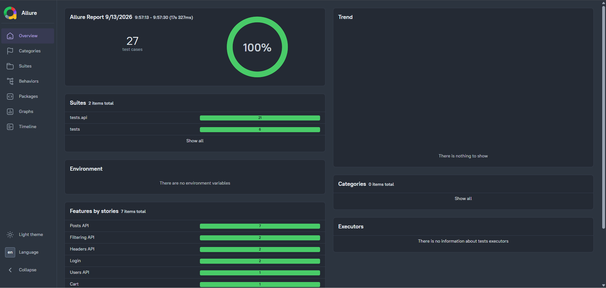

# QA Automation Showcase


UI and API automation tests built with **Python**, **Playwright**, **pytest**, and **requests**.

## 🛠️ Tech Stack

- Python 3.14
- Playwright 1.62
- pytest 9.1
- requests 2.34
- Allure 2.46
- Page Object Model
- Locators separated from page logic

## 📋 About the Test Targets

This project demonstrates UI and API testing techniques using two public practice resources:

- **SauceDemo** (UI) — an e-commerce demo site with login, cart, and checkout flows.
- **JSONPlaceholder** (API) — a free REST API for testing HTTP methods (GET, POST, PUT, DELETE).

Both are widely used for QA practice and require no registration or API keys.

## 📁 Project Structure

```
qa-automation-showcase/
│
├── .github/
│   └── workflows/
│       └── tests.yml              # CI: 3 browsers × 35 tests
│
├── api_clients/
│   ├── __init__.py
│   └── posts_client.py            # API client for JSONPlaceholder
│
├── config/
│   ├── __init__.py
│   ├── credentials.py             # Test credentials (real projects: .gitignore)
│   └── settings.py                # URLs for UI and API targets
│
├── docs/
│   ├── allure-report.png          # Allure report screenshot
│   └── bug-reports/
│       ├── README.md
│       ├── BUG-001-sorting-not-working.md
│       ├── BUG-002-add-to-cart-not-working-for-some-items.md
│       ├── BUG-003-last-name-field-overwrites-first-name.md
│       ├── BUG-004-validation-shows-all-fields-required.md
│       ├── BUG-005-wrong-product-images.md
│       └── screenshots/           # GIFs and PNGs for bug reports
│
├── fixtures/
│   ├── __init__.py
│   └── auth.py                    # Auth fixtures
│
├── locators/
│   ├── __init__.py
│   ├── login_locators.py
│   ├── inventory_locators.py
│   ├── cart_locators.py
│   └── checkout_locators.py
│
├── pages/
│   ├── __init__.py
│   ├── login_page.py
│   ├── inventory_page.py
│   ├── cart_page.py
│   └── checkout_page.py
│
├── tests/
│   ├── api/
│   │   ├── __init__.py
│   │   ├── test_posts.py
│   │   ├── test_users.py
│   │   ├── test_filtering.py
│   │   └── test_headers.py
│   ├── __init__.py
│   ├── test_login.py
│   ├── test_cart.py
│   ├── test_cart_empty.py
│   ├── test_checkout.py
│   ├── test_checkout_negative.py
│   └── test_sorting.py
│
├── .gitignore
├── conftest.py                    # pytest_plugins + Allure screenshot hook
├── pytest.ini
├── requirements.txt
└── README.md
```

## ✅ Test Coverage

### UI Tests (SauceDemo)
- **Login:** successful login, parametrized negative scenarios (locked-out, wrong password)
- **Cart:** add one item, add multiple items, empty cart state
- **Checkout:** full end-to-end flow, negative scenarios (empty fields)
- **Sorting:** by name (A→Z, Z→A), by price (low→high, high→low)

### API Tests (JSONPlaceholder)
- **GET:** single post, all posts, status codes (200/404)
- **POST:** create a new post
- **PUT:** update an existing post
- **DELETE:** delete a post
- **Filtering:** posts by userId, comments by postId (query parameters)
- **Users:** nested objects (address, company, geo)
- **Headers:** response Content-Type validation
- **Validation:** response structure, required fields, data types

## 🐛 Manual QA: Bug Reports

In addition to automated tests, manual exploratory testing was performed on SauceDemo. Found bugs are documented in [`docs/bug-reports/`](docs/bug-reports/).

| ID | Title | Severity | Priority |
|----|-------|----------|----------|
| [BUG-001](docs/bug-reports/BUG-001-sorting-not-working.md) | Sorting does not work for problem_user | Major | High |
| [BUG-002](docs/bug-reports/BUG-002-add-to-cart-not-working-for-some-items.md) | "Add to cart" works only for 3 of 6 products | Major | High |
| [BUG-003](docs/bug-reports/BUG-003-last-name-field-overwrites-first-name.md) | Last Name field overwrites First Name | Critical | High |
| [BUG-004](docs/bug-reports/BUG-004-validation-shows-all-fields-required.md) | Validation shows "required" error for all fields | Critical | High |
| [BUG-005](docs/bug-reports/BUG-005-wrong-product-images.md) | All products show the same image | Major | Medium |

## 🏗️ Architecture

The project follows **Page Object Model** (UI) and **API Client** (API) patterns with a separate **Locators** layer:

- **`locators/`** — all CSS selectors in one place per page. If the UI changes, only locators need updating.
- **`pages/`** — page objects with actions and assertions. No raw selectors inside — only references to locators.
- **`api_clients/`** — API client classes with methods for each HTTP endpoint.
- **`fixtures/`** — reusable pytest fixtures for setup (login, page initialization).
- **`config/`** — test data, credentials, and environment URLs.
- **`tests/`** — clean, readable tests using page objects and API clients.

## 🌐 Cross-Browser Testing

All UI tests run across three browser engines:

- **Chromium** — engine for Chrome and Edge
- **Firefox** — Mozilla's engine
- **WebKit** — engine for Safari

CI runs the full test suite on all three browsers in parallel using GitHub Actions matrix strategy.

## 🚀 How to Run

1. Clone the repository:
   ```bash
   git clone https://github.com/NordQA22/qa-automation-showcase.git
   cd qa-automation-showcase
   ```

2. Create a virtual environment and install dependencies:
   ```bash
   python -m venv .venv
   .venv\Scripts\activate   # Windows
   pip install -r requirements.txt
   playwright install
   ```

3. Run all tests:
   ```bash
   pytest tests/ -v
   ```

4. Run only UI tests:
   ```bash
   pytest tests/ -v -m ui
   ```

5. Run only API tests:
   ```bash
   pytest tests/ -v -m api
   ```

6. Run with visible browser:
   ```bash
   pytest tests/ -v --headed
   ```

7. Run tests in a specific browser:
   ```bash
   pytest tests/ -v --browser=chromium
   pytest tests/ -v --browser=firefox
   pytest tests/ -v --browser=webkit
   ```

## 📊 Test Reports



### HTML Report

```bash
pytest tests/ --html=report.html --self-contained-html
```

### Allure Report

The project uses **Allure** for detailed reports with steps and screenshots on failure.

```bash
pytest tests/
allure serve allure-results
```

---

**Author:** Ivan Taran — QA Engineer
- Telegram: [@Ivan_T_QA](https://t.me/Ivan_T_QA)
- GitHub: [NordQA22](https://github.com/NordQA22)