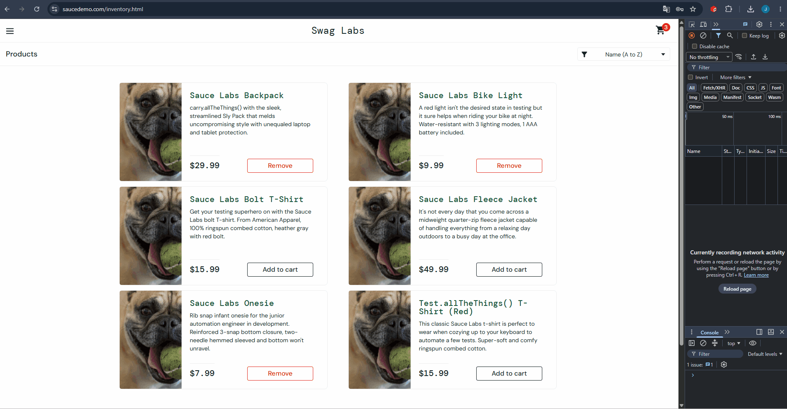

# BUG-001: Sorting does not work for problem_user

## Summary
None of the four sorting options on the Products page have any effect for `problem_user` — the product order remains unchanged.

## Environment
- **URL:** https://www.saucedemo.com/inventory.html
- **User:** `problem_user` / `secret_sauce`
- **Browser:** Google Chrome (Windows 11)

## Preconditions
1. User is logged in as `problem_user`
2. User is on the Products page

## Steps to Reproduce
1. Open https://www.saucedemo.com/
2. Log in as `problem_user` with password `secret_sauce`
3. Click the sort dropdown (default: "Name (A to Z)")
4. Select **"Name (Z to A)"** → observe product order
5. Select **"Price (low to high)"** → observe product order
6. Select **"Price (high to low)"** → observe product order

## Expected Result
Products are re-ordered according to the selected sorting option.

## Actual Result
None of the four sorting options change the product order. Sorting is completely non-functional.

## Severity
**Major**

## Priority
**High**

## Attachments
- 