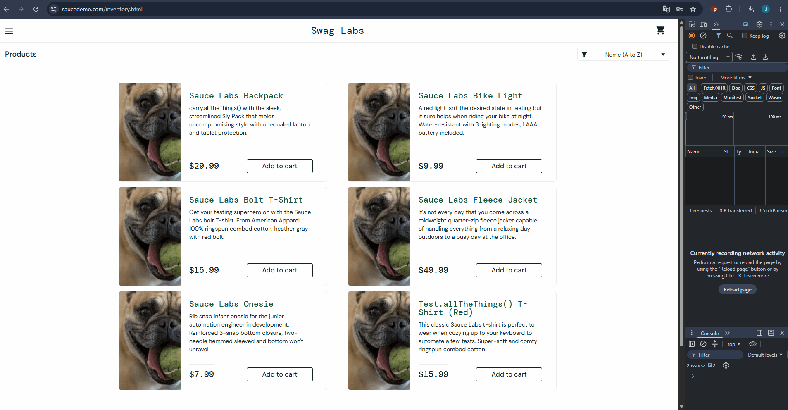

# BUG-002: "Add to cart" works only for 3 out of 6 products

## Summary
For `problem_user`, the "Add to cart" button works only for half of the products on the Products page. Clicking the button on the remaining items has no effect — the cart badge does not update.

## Environment
- **URL:** https://www.saucedemo.com/inventory.html
- **User:** `problem_user` / `secret_sauce`

## Steps to Reproduce
1. Log in as `problem_user`
2. On the Products page, click **"Add to cart"** on **Sauce Labs Backpack**
3. Observe the cart badge → shows **1** (works)
4. Click **"Add to cart"** on **Sauce Labs Bolt T-Shirt**
5. Observe the cart badge → still **1** (does not work)
6. Repeat for the remaining 4 products

## Expected Result
All 6 products can be added to the cart; the cart badge increments each time.

## Actual Result
Only 3 out of 6 products add successfully. For the remaining 3 products, the button click has no effect.

## Severity
**Major**

## Priority
**High**

## Attachments
- 