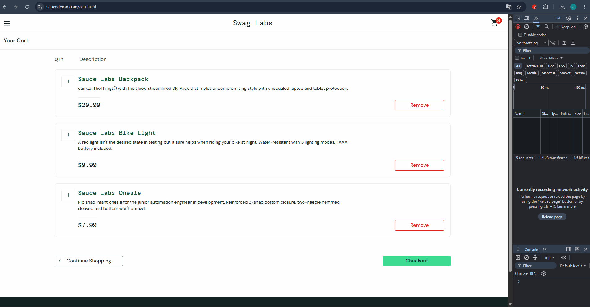

# BUG-003: Last Name field overwrites First Name during checkout

## Summary
On the checkout information page, typing into the **Last Name** field overwrites the value in the **First Name** field instead of filling its own input.

## Environment
- **URL:** https://www.saucedemo.com/checkout-step-one.html
- **User:** `problem_user` / `secret_sauce`

## Steps to Reproduce
1. Log in as `problem_user`
2. Add any product to the cart
3. Go to the cart → click **Checkout**
4. On the checkout form, enter **First Name:** `Ivan`
5. Click on **Last Name** field and type `Taran`
6. Observe the First Name field

## Expected Result
- First Name: `Ivan`
- Last Name: `Taran`

## Actual Result
- First Name: `Taran` (overwritten by the Last Name input)
- Last Name: empty

The Last Name field is non-functional and overwrites First Name.

## Severity
**Critical**

## Priority
**High**

## Attachments
- 