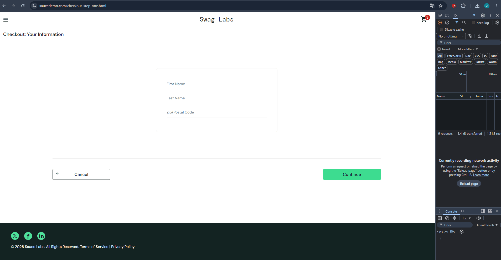

# BUG-004: Checkout validation shows "required" error for all fields simultaneously

## Summary
Because of BUG-003, the **Last Name** field cannot be filled. When the user clicks **Continue**, the checkout form shows a validation error for all three fields at once, including fields that were correctly filled.

## Environment
- **URL:** https://www.saucedemo.com/checkout-step-one.html
- **User:** `problem_user` / `secret_sauce`

## Preconditions
- BUG-003 is present (Last Name overwrites First Name)

## Steps to Reproduce
1. Log in as `problem_user`
2. Add a product → go to cart → **Checkout**
3. Enter First Name: `Ivan`
4. Try to enter Last Name: `Taran` → First Name becomes `Taran`, Last Name remains empty
5. Enter Postal Code: `123456`
6. Click **Continue**

## Expected Result
The form proceeds to the next step, or at most shows a single error for the empty Last Name field.

## Actual Result
The form shows a validation error for **all three fields** (`First Name is required`, `Last Name is required`, `Postal Code is required`) — even though First Name and Postal Code are filled.

## Severity
**Critical**

## Priority
**High**

## Attachments
- 